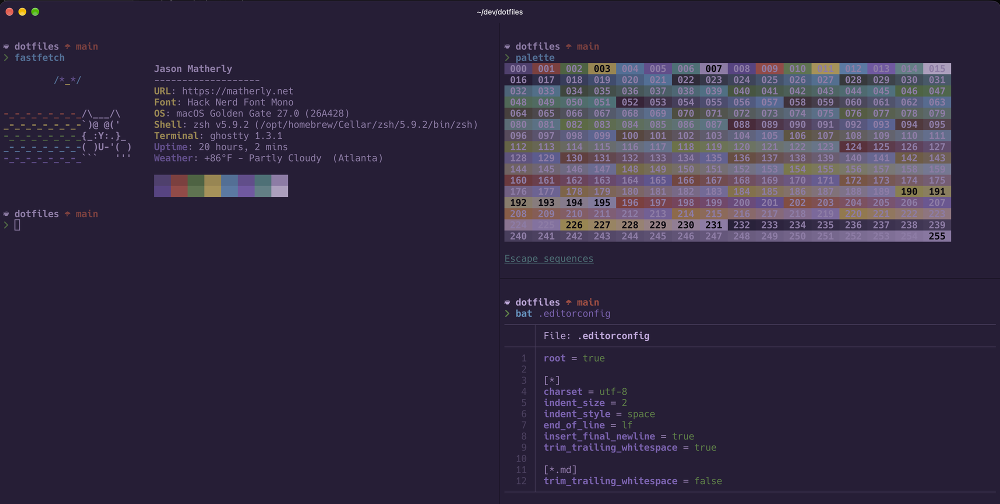

# ~jason 🛠️

Jason's personal dotfiles for configuring macOS with Zsh and Homebrew — a personalized fork of [nicksp/dotfiles](https://github.com/nicksp/dotfiles).



> [!WARNING]  
> These are personal, opinionated dotfiles. Review `setup/macos.sh` and `setup/Brewfile` before running them on a new machine.

## Requirements

- macOS on Apple Silicon (the scripts expect Homebrew at `/opt/homebrew`); the macOS defaults were reviewed for macOS 27
- Homebrew (installed in step 1 below, or by `setup/brew.sh` if missing)
- Zsh — Homebrew's, from the Brewfile; `setup/zsh.sh` makes it your login shell

## What's in there?

- Custom color scheme: [Squirrelsong](colors/).
- Handy [CLI scripts](bin/), including [`brewpick`](bin/brewpick) — the Brewfile installer used by `setup/brew.sh` (`brewpick --all`), which can also run as an fzf checklist to install just a subset of the formulae/casks/VS Code extensions.
- [`upup`](bin/upup): one command to update macOS, Homebrew, runtimes and the rest (see [Updating](#updating)).
- Coding agents [config automation](agents/): shared instructions for Amp and Codex, plus Claude Code's plugins, settings and skills, restored by setup along with a catalog of everything installed.
- [Custom zsh theme](tilde/.starship.toml) with Git status, etc. using [Starship](https://starship.rs/).
- Runtime versions (Node, Python, etc.) managed by [mise](https://mise.jdx.dev/), activated in [`tilde/.zprofile`](tilde/.zprofile) (shims, for GUI apps) and [`zsh/init.zsh`](zsh/init.zsh) (full shell integration).
- [Git aliases](tilde/.gitconfig), with identity/signing configured per-machine via `~/.gitconfig.local` (see [Local customizations](#local-customizations)) — commit signing via SSH through 1Password, or GPG.
- [Zsh aliases](zsh/aliases.zsh).
- [Obsidian](obsidian/) setup — settings, theme, plugins, templates and Bases views — installed into the iCloud Drive → Notes vault with `obsidian-vault install` (see [first-time setup](obsidian/README.md#first-time-setup)).
- [fzf](zsh/fzf.zsh) in Zsh: fuzzy history, file and directory pickers with previews.
- [hunk](https://github.com/modem-dev/hunk) as the terminal diff viewer for git, lazygit and gh.
- Sensible [macOS defaults](setup/macos.sh), prompting for a computer name so it's reusable across machines.
- [VS Code settings](vscode/), symlinked from the repo (VS Code's built-in Settings Sync stays off — the dotfiles are the source of truth).
- [Firefox Developer Edition styles](firefox/) (optional — the browser isn't in the Brewfile).
- Terminal config for [Ghostty](tilde/.config/ghostty/) and [cmux](tilde/.config/cmux/), and for the tools in them: bat, btop, fastfetch, gh, lazygit.
- [Fonts](fonts/README.md): Hack Nerd Font Mono in the terminals (Ghostty, cmux, fastfetch) and Iosevka Code in VS Code. The Nerd Fonts are Brewfile casks; Iosevka Code has no cask, so `bin/install-iosevka-code` installs it. MonoLisa is an optional paid font (`bin/brewpick` → MonoLisa opens its download page).
- [macOS apps and VS Code extensions](setup/Brewfile) I use.
- [macOS tips & tricks](docs/macos%20tips%20%26%20tricks.md).
- Built-in help: `help` shows the [alias index](docs/README.md), `help <command>` documents any script in `bin/`, and `help gui/<app>` shows [shortcut cheat sheets](docs/gui/) for GUI apps.

## Installation

On a new Mac, clone over HTTPS — SSH only works after 1Password is set up (keys live there, see [`~/.ssh/github_personal.pub`](#sshgithub_personalpub)).

1. Install the Command Line Tools (for `git`) and [Homebrew](https://brew.sh):

   ```shell
   xcode-select --install
   /bin/bash -c "$(curl -fsSL https://raw.githubusercontent.com/Homebrew/install/HEAD/install.sh)"
   eval "$(/opt/homebrew/bin/brew shellenv)" # the installer doesn't put brew on PATH
   ```

1. Clone the repo (no GitHub login needed; `setup/misc.sh` offers `gh auth login` later):

   ```shell
   git clone https://github.com/jrmatherly/dotfiles.git ~/dev/dotfiles
   ```

   Setting up your own Mac? Fork the repo, clone your fork instead, and go through [Make it yours](#make-it-yours) before running setup.

1. Optional, for signed commits from the start: install 1Password (`brew install --cask 1password`), sign in and turn on **Settings → Developer → Use the SSH agent**. `setup/symlinks.sh` asks how to sign commits — [SSH via 1Password](https://www.1password.dev/ssh/git-commit-signing) (`op-ssh-sign`; paste your public key when asked), GPG, or none — and writes `~/.gitconfig.local`. Choose none if 1Password isn't ready yet and add signing to `~/.gitconfig.local` later.
1. Run the setup — [automatically](#automatically) or [manually](#manually).
1. Finish the steps setup can't do for you: see [After setup](#after-setup).

The repo can live anywhere — the scripts resolve their own location, and `~/.zshenv` exports it as `$DOTFILES`. `setup.sh` also creates a `~/dotfiles` symlink pointing at the clone, for the few configs that can't expand variables (e.g. lazygit's `shellFunctionsFile`).

### Manually

```shell
# after cloning as in step 2 above
cd ~/dev/dotfiles
ln -s "$PWD" ~/dotfiles # compatibility path for configs that can't expand variables
./setup/brew.sh         # must run first: the later scripts use Homebrew tools
./setup/zsh.sh
./setup/misc.sh
./setup/symlinks.sh
./setup/dash.sh # optional: Dash docsets from local folders
```

`setup.sh` also does a few things the manual path skips: it enables Touch ID for `sudo` (`/etc/pam.d/sudo_local`), keeps `sudo` authorized so long installs don't ask for the password again, and exports telemetry opt-outs (.NET, PowerShell, Azure CLI, Azure Functions Core Tools, Aspire, CodeGraph) before `misc.sh` installs those tools.

### Automatically

To automate the setup of your dotfiles on a new machine, use the [setup](./setup.sh) script.

> [!CAUTION]  
> Use at your own risk!

```shell
~/dev/dotfiles/setup.sh # after cloning as in step 2 above
```

This will install all required dotfiles in your home directory as symlinks. Everything is then configured by editing files in the clone. For a diagram of what it runs, what it downloads and what needs `sudo`, see [setup/README.md](setup/README.md#setupsh-orchestrator).

Options:

| Flag | Effect |
| --- | --- |
| `-y`, `--yes` | Don't wait for confirmation before starting |
| `--skip-brew` | Skip `brew update` and the Brewfile install (use when re-running for dotfiles changes) |
| `--skip-codegraph` | Don't install [CodeGraph](https://github.com/colbymchenry/codegraph) or connect it to Claude Code (an existing install is left alone) |
| `--dash` | Also run the optional [Dash docset setup](setup/dash.sh) |
| `-h`, `--help` | Print usage and exit |

Along the way it prompts for your git identity and commit signing (`~/.gitconfig.local`), and offers to run `gh auth login` if the GitHub CLI isn't authenticated yet. Existing files and folders in `$HOME` (including `~/.zshrc`) are never replaced silently — each one prompts for skip / overwrite / backup, and anything unanswered is skipped. If `/etc/pam.d/sudo_local` doesn't exist yet, it's created to enable Touch ID for `sudo`.

### After setup

Setup leaves these to you:

1. Open a new terminal, so the shell picks up the new config and `$DOTFILES/bin` is on PATH.
1. Set up GitHub SSH through 1Password: add your key's public half to GitHub, save it as [`~/.ssh/github_personal.pub`](#sshgithub_personalpub), check with `ssh -T git@github.com`, and optionally switch the clone to SSH: `git remote set-url origin git@github.com:jrmatherly/dotfiles.git`.
1. Apply the macOS defaults: [`set-defaults`](#set-macos-defaults).
1. In VS Code, run **SpaceBox Enable UI Enhancer** from the Command Palette, then quit and reopen VS Code. The blur settings do nothing until then, and the step is needed again after each VS Code update (see [vscode](vscode/README.md#spacebox-ui-enhancer)).
1. Install the Obsidian vault settings: [`obsidian-vault install`](#set-up-the-obsidian-vault).
1. Import the color themes that apps can't read from the repo: [`install-color-themes`](#install-color-themes).

## Extras

### Set macOS defaults

```shell
set-defaults
```

Runs [`setup/macos.sh`](setup/macos.sh): keyboard, trackpad, Finder, Dock and system preferences, with prompts for the security-sensitive and per-machine ones. See [what it changes](setup/README.md#macos). At the end it force-quits Finder, Dock, Messages, Activity Monitor, Notification Center, SystemUIServer and Terminal — so quit Messages first and run it from Ghostty, Warp, cmux or iTerm2 rather than Terminal.app. Log out afterwards so key repeat takes effect. Safari isn't configured by it; set Safari up in Safari → Settings.

### Use alternative apps icons

Refer to the [icons documentation](icons/README.md) for available icon variants.

### Install color themes

```shell
install-color-themes
```

The [Squirrelsong](colors/) theme files are owned by this repo — nothing is downloaded. bat, btop and Ghostty (and cmux) read theirs straight from the repo; the script rebuilds bat's theme cache, prints where to import the Nimble Commander, Syntax Highlight and CotEditor themes, and copies the Obsidian theme into your vault (`$OBSIDIAN_VAULT`) if it exists. To change a theme, edit the file in the repo and commit it.

### Set up the Obsidian vault

```shell
obsidian-vault install # repo → iCloud Drive/Notes (quit Obsidian first)
obsidian-vault capture # bring settings/templates changed in Obsidian back to the repo
```

See [obsidian](obsidian/README.md) for the vault layout and the first-time walkthrough.

### Configure Dash docsets

Dash's built-in Docset Generator (Settings → Downloads → Docset Generator) can index local folders of **HTML** documentation — not Markdown. The paths are machine-specific, so they're configured interactively rather than committed. Docsets you download inside Dash are separate: Dash stores those in `~/Library/Application Support/Dash/DocSets` and syncs the list itself.

```shell
setup/dash.sh                                          # prompts for folder, name, keyword
setup/dash.sh add ~/dev/myapp/docs/html "My App" myapp # or add one directly
```

This edits the repo's Dash sync file, so it only takes effect once Dash's sync folder (Dash → Settings → General) points at the repo's `dash/` folder. Quit Dash before running it.

## Make it yours

Setup already asks for your git identity, commit signing and computer name. These values are hard-coded to me, so change them in your fork:

| File | What to change |
| --- | --- |
| `README.md`, [`docs/macos tips & tricks.md`](docs/macos%20tips%20%26%20tricks.md) | Title, intro and the `jrmatherly/dotfiles` clone URL and link |
| [`agents/README.md`](agents/README.md) | The `jrmatherly/skills` links point to my private skills repo — use your own, or the public [skills CLI](https://github.com/vercel-labs/skills) |
| [`tilde/.config/fastfetch/config.jsonc`](tilde/.config/fastfetch/config.jsonc) | Name, URL and weather `location` |
| [`lazygit/config.yml`](lazygit/config.yml) | The author name under `authorColors` |
| [`vscode/User/settings.json`](vscode/User/settings.json) | `notes.notesLocation` — an absolute path with my user name (the Notes extension can't expand `~`) |
| [`agents/claude-*`](agents/) | My Claude Code plugins, settings and skills. Run `claude-config save` once yours are installed and commit the result |
| [`agents/catalog/curated.toml`](agents/catalog/curated.toml) | Notes on my tools. `claude-catalog` still builds but exits 1 (a warning in setup) for each entry you don't have installed, like my `coolify` MCP server — delete those |
| [`setup/Brewfile`](setup/Brewfile) | My apps. Trim it, or pick a subset with `bin/brewpick` |
| [`LICENSE`](LICENSE) | Add your copyright line; keep the existing ones (MIT requires it) |

## Local customizations

The dotfiles can be extended to suit additional local requirements by using the following files:

### `~/.zsh.local`

If this file exists, it's sourced near the end of `~/.zshrc` (after `zsh/init.zsh`), so its content can add to or override the existing aliases, settings, PATH, etc.

### `~/.ssh/config.local`

If this file exists, it will be automatically included after the public SSH hosts to specify any additional SSH hosts.

### `~/.ssh/github_personal.pub`

SSH keys live in 1Password, and `tilde/.ssh/config` pins `github.com` to your personal key by pointing at this _public_ key file (1Password's ["Match key with host"](https://www.1password.dev/ssh/agent/advanced) pattern). It's machine-local and not in the repo — on a new Mac, export the public key from 1Password into this file, or copy the matching line from:

```shell
SSH_AUTH_SOCK=~/Library/Group\ Containers/2BUA8C4S2C.com.1password/t/agent.sock ssh-add -L
```

`setup/symlinks.sh` warns if it's missing. Test with `ssh -T git@github.com`.

> [!IMPORTANT]  
> 1Password must be running and unlocked, with **Settings → Developer → Use the SSH agent** turned on, for GitHub SSH and signed commits to work. Turning on "Keep 1Password in the menu bar" and "Start at login" keeps the agent available.

### `~/.gitconfig.local`

If this file exists, it will be automatically included after the configurations from `~/.gitconfig` allowing its content to overwrite or add to the existing `git` configurations.

> [!TIP]  
> Use `~/.gitconfig.local` to store sensitive information such as the `git` user credentials for individual repositories.

`setup/symlinks.sh` writes your identity and commit signing here. Anything a tool tries to add to `~/.gitconfig` (e.g. Git Credential Manager registering itself) belongs here too, since `~/.gitconfig` is a symlink into the repo.

> [!NOTE]  
> `git config --global --get …` does **not** follow includes, so it won't show values from this file. Use `git config --get …` (or add `--includes`).

## Updating

```shell
upup
```

[`upup`](bin/upup) is the routine update command, and it works from any directory. It:

- pulls the latest dotfiles (`git pull` in the clone)
- installs macOS software updates (a macOS update asks for your login password: see [below](#macos-update-password-from-1password-optional))
- upgrades Homebrew formulae and casks (VS Code included) without asking for confirmation, since it prints the list first, then cleans up
- upgrades mise tools (Node/Python patch releases, CodeGraph, the npm CLIs) and uv tools (Serena)
- reinstalls the Iosevka Code font if its upstream zip changed
- records the Claude Code plugins, base settings and user skills in the repo (`claude-config save`, review with `git diff`) and rebuilds the catalog (`claude-catalog`)
- asks Raycast to check for app and extension updates
- updates Amp, if it's installed

It doesn't re-apply the dotfiles. When a pull brings new symlinks, tools or config, run setup again:

```shell
"$DOTFILES/setup.sh" --skip-brew # drop --skip-brew to also install new Brewfile entries
```

`setup.sh` installs what's missing but doesn't upgrade what's already there; that's `upup`'s job.

An update of VS Code replaces the files the SpaceBox UI Enhancer patched, so run **SpaceBox Enable UI Enhancer** again afterwards (see [vscode](vscode/README.md#spacebox-ui-enhancer)).

### macOS update password from 1Password (optional)

`upup` starts with a fingerprint for `sudo`, but a macOS update still stops at `Password:`. That prompt comes from `softwareupdate` itself: on Apple Silicon only the account password authorizes an OS update, and neither `sudo` nor Touch ID counts. If you keep that password in 1Password, `upup` can fetch it with a fingerprint instead. Without this setup nothing changes and you type the password as before.

1. In 1Password, save your Mac login password as an item (a Login or Password item; any vault).
1. Turn on **Settings → Developer → Integrate with 1Password CLI**. The `op` command comes from the Brewfile (`1password-cli`).
1. Copy the field's secret reference: open the item, click the arrow next to the password field → **Copy Secret Reference**. It looks like `op://Private/Mac login/password`.
1. Add it to [`~/.zsh.local`](#zshlocal), which is machine-local and not in the repo (create the file if it doesn't exist yet):

   ```shell
   export DOTFILES_MAC_PASSWORD_OP='op://Private/Mac login/password'
   ```

1. Open a new terminal and check that it resolves (this prints nothing but `ok`):

   ```shell
   op read "$DOTFILES_MAC_PASSWORD_OP" > /dev/null && echo ok
   ```

`upup` only asks 1Password when a macOS update is actually pending. If `op` is missing, the variable is unset, or the password is rejected, it falls back to the normal `Password:` prompt. Update the 1Password item when you change your login password.

## Changing the dotfiles

Edit the files in the clone: everything in `$HOME` is a symlink into it. Before committing, run the checks (shell syntax, shellcheck, Prettier):

```shell
pnpm check  # lint and format check
pnpm format # fix formatting
```

## License

MIT License.

## Inspiration

This repo started as a personalized fork of [nicksp/dotfiles](https://github.com/nicksp/dotfiles), which itself credits:

- [holman/dotfiles](https://github.com/holman/dotfiles)
- [mathiasbynens/dotfiles](https://github.com/mathiasbynens/dotfiles)
- [sapegin/dotfiles](https://github.com/sapegin/dotfiles)
- <https://remysharp.com/2018/08/23/cli-improved>
- <https://evanhahn.com/a-decade-of-dotfiles/>
- <https://cpojer.net/posts/set-up-a-new-mac-fast>
- <https://thevaluable.dev/zsh-install-configure-mouseless/>
