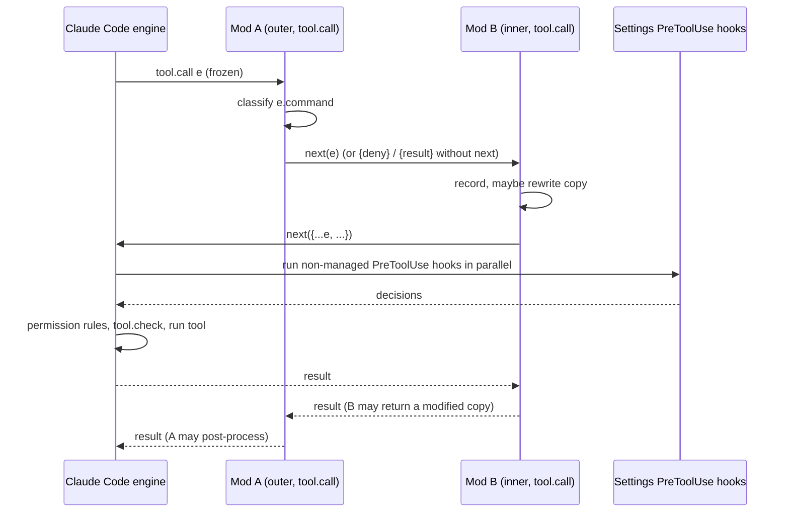

# Claude Code mods: how they work, what the first week built, and what Jason should adopt

Synthesized 2026-10-08 from five explorer reports (explorer-docs, explorer-local, explorer-web, explorer-repos-a, explorer-repos-b) plus direct reads of the cached doc pages under `~/.claude-code-docs/cache/`. Installed Claude Code is 2.1.295. Every claim names its source or carries a label (measured, inferred, unverified).

## Overview

A mod is a plugin whose `hooks/hooks.json` has a `modules` key pointing at one JavaScript or TypeScript module that exports `register(on, options)` (create page, steps 3 and 4). The module runs inside Claude Code's process, in a shared hooks worker thread, and each `on(event, matcher?, hook)` call installs a middleware function `($, e, next)` on an engine event (reference page, "The hook function"). Classic settings hooks still exist and are not deprecated (overview page, Note); they run a script outside the process and can block, allow, log or add context, but cannot draw anything. A mod can draw panes, bands and toasts, register slash commands and tools, rewrite prompts and system-prompt sections, hold a tool call while asking the user, call a model on the user's plan, and veto other mods' API calls (overview page, comparison table). That is the whole reason it exists next to classic hooks. It is in-process code with shared state and a drawing API.

The feature is one week old. The admin page says mods are on by default from 2.1.286 (admin.md line 11); the overview says use 2.1.287 or later in the terminal and 2.1.286 in the Desktop app (overview.md line 97); the changelog carries "Added Claude Mods" in the 2.1.287 block dated October 1, 2026 (changelog.md lines 492 to 493), and its 2.1.286 block has no mod line (explorer-docs, Open Questions, and my grep). Between 2.1.287 and 2.1.295 the API gained `$.ui.selection` (2.1.288), `ui.fault` and teammate `agent.spawn` (2.1.289), `ceiling` and `agentId` on `tool.check` and a validate line for gating hooks (2.1.290), `prompt.autocomplete`, prompt caching in `$.model.complete` and several gating-semantics fixes (2.1.292), and `isDeferred` on `$.tool.register` (2.1.293) (explorer-docs, "Recent changelog"). Fixes in 2.1.290 and 2.1.292 changed what happens when a guard's `.catch` is skipped or a deny arrives after `next(e)`, so guard behaviour written against 2.1.287 may differ today (explorer-docs, Non-Obvious Things). Verdict in one sentence: Jason should build one small prototype to learn the shape (the jstack step band below), should not replace anything that works today, and should fix the hook fan-out by pruning plugins rather than by adding a mod.

## Key concepts

| Concept | Definition | Source |
|---|---|---|
| Manifest | Ordinary `.claude-plugin/plugin.json`. Optional `types` (path to a `.d.ts` declaring `PluginState`), `userConfig` (arrives as `options`), `dependencies` (a mod runs before its dependencies). No mod-specific required field. | reference page, "Files" |
| `hooks/hooks.json` `modules` | Array with exactly one path relative to hooks.json. Its presence makes the plugin a mod. Classic `hooks` may sit beside it. | create page, step 3 |
| `register(on, options)` | Called once per load and per hot reload. Module-level variables reset on every reload. | create page, step 4 |
| Hook signature `($, e, next)` | `$` is the mods API, `e` the deeply frozen event, `next(e)` hands the event to the next hook and finally the engine. `next.signal`, `next.origin`, `next.budget`, and in `.catch` only `next.error` and `next.called`. | reference page, "The hook function" |
| Observe, rewrite, answer | `return next(e)` observes; `next({ ...e, field })` rewrites; returning a result without calling `next` answers the event. | overview and events pages |
| Gating hooks and `.catch` | A hook that can deny. Without `.catch` a throw or timeout before `next` skips the hook and the chain continues, so the tool runs (fails open). `.catch(($, e, next) => ...)` runs on throw, timeout or wrong shape, 1 s budget; return `{ deny }` to fail closed. | events page, "Run alongside other mods"; explorer-docs lines 106 to 113 |
| Event families | `tool.*`, `prompt.*`, `command.*`, `config.*`, `turn.*`, `session.*`, `agent.*`, `ui.*`, `plugin.register`, `engine.create`, `telemetry.*`, `classic.<Event>`, and every API method as `namespace.method`. | reference page, "Events" |
| UI surfaces | `Pane` (sidebar in a wide fullscreen terminal, else framed region above the prompt), `AbovePrompt` (one shared band), `$.ui.status` (one line under the prompt prefixed with a warning sign and the mod name), `$.ui.toast`, `$.ui.log`, and Claude Code's own sites (`Spinner`, `ToolUse`, `UserMessage`, `AskUserQuestion`, `PromptHint`, `SessionMode`, `InfoNotice`, others). | reference page, "Render sites" table lines 194 to 208; api.md line 130 |
| `$.state`, `$.store`, `$.config` | `$.state` is reactive, per session, survives reload, reset by `/clear`, `/resume`, `/branch`; needs a `PluginState` declaration. `$.store` is a per-plugin JSON file under `~/.claude/plugins/store/`, shared by all sessions, 4 MiB, not atomic. `$.config.list/set` reads and writes Claude Code's `/config` rows. | reference page, "Mods API methods" |
| `$.model.complete`, `$.model.fork` | `complete` sends one prompt outside the conversation on the user's credentials; failure returns `isAnswered: false`, not a rejection. `fork` asks over the current conversation and mostly hits the prompt cache. | api page, "Call a model" |
| `$.tool.register` and `isDeferred` | Registers `mcp__<plugin>__<name>`; handled by a `tool.call` hook returning `{ result }`. When MCP tool search defers the tool, Claude sees its name only; `isDeferred: false` loads it upfront and needs 2.1.293 or later. | api.md lines 67 to 70 |
| `$.process.spawn` | Streams a process; `$.process.run(argv)` resolves `{ exitCode, stdout, stderr }`, no shell, 30 s default timeout. Not covered by the org network policy that covers `$.http.fetch`. | reference page, "Mods API methods"; admin page |
| `$.session.append` | Writes a row into the stored conversation. Testable since 2.1.293 via `mock.session`. | reference page; changelog 2.1.293 |
| `$.ui.mount` in tests | Mounts a render site in `claude plugin test`, returns a handle with `press`, `input`, `select`, `find`, `unmount`. Checks tree validity, not pixels. | test page, "Drawing tests" |
| `mock.*` | `mock.clock`, `mock.store`, `mock.env`, `mock.session` for tests. | test page |
| `sec-default@builtin` | Built-in guard that loads outermost on managed or Team/Enterprise machines and fails closed. Not loaded for a solo API-key or Pro/Max user without managed settings. | admin page, "Know what happens by default" |
| `allowManagedModsOnly` | Guard option in managed `pluginConfigs` that refuses users' own mods; status lines and settings hooks keep working. | admin.md lines 46 and 149 |
| `prependPlugins`, `appendPlugins` | Managed lists placing org mods before or after user mods. Order: guard and org mods, user mods, `appendPlugins`, other built-ins. | events page, "The order mods run in" |

Minimal manifest and module, quoted once from the create page (steps 2 to 4):

```json
{ "name": "first-mod", "version": "0.1.0", "description": "Counts Claude's tool calls", "author": { "name": "Your Name" } }
```

```json
{ "modules": ["./register.js"] }
```

```javascript
let calls = 0
export function register(on) {
  on('session.start', async ($, e, next) => {
    await $.command.register({ name: 'tally', description: 'Show how many tool calls Claude has made' })
    return next(e)
  })
  on('tool.call', async ($, e, next) => { calls += 1; $.ui.invalidate('ui.render'); return next(e) })
  on('command.run', { command: 'tally' }, async () => ({ text: 'Claude has made ' + calls + ' tool calls' }))
  on('ui.render', { component: 'Spinner' }, async ($, e, next) =>
    next({ ...e, props: { ...e.props, suffix: ' · tool calls: ' + calls } }))
}
```

## How it works

**Install to unload.** A mod installs like any plugin (`/plugin install <name>@<marketplace>`), or loads from a folder with `claude --plugin-dir ./mod`, which watches the folder and hot-reloads on save (create page, "Run it"). Installed plugins are cached by version, so edits to the cache do nothing until the version is bumped (explorer-docs, Load step 2). At load the engine statically analyses the module with the same rules as `claude plugin validate` and refuses modules that alias `$`, compute event names, use dynamic `import()` or shadow `on` (create page, "What the analysis needs"). On success the debug log prints `hooks module <name>@inline loaded (worker, ...)` (explorer-docs, Load step 6). A hook that blocks the worker crashes it and unloads the culprit; three untraceable crashes unload every non-built-in mod until `/reload-plugins` (explorer-docs, Load step 7). `session.start` fires once per loaded mod before the first prompt and again after each reload, but not after `/clear`, `/resume` or `/branch`; mods that persist state reload it in a `classic.SessionStart` hook filtered on `source` (reference page, "Events"; claude-skins register.tsx lines 172 to 177).

**An event through several mods.** Hooks on one event form one middleware chain ordered by tier, then by `dependencies`, then by the order of `on` calls (events page, "The order mods run in"). The first mod sees the event first and the result last. Managed `PreToolUse` settings hooks run before the first mod and a block is final; every other settings hook and plugin `hooks.json` hook runs after the last mod calls `next`, as part of the engine's own behaviour, so a mod that answers `tool.call` without `next` suppresses them (events.md lines 298 to 301). Then the permission check and `tool.check` run, then the tool.

**Deny, redraw, failure.** `{ deny: text }` from `tool.call` is what Claude reads as the tool result, so the text is written as an instruction (blast-radius.mjs lines 104 to 106 end with "Do not retry it unless the user asks you to"). The engine redraws a site only when its props or the terminal width change; a mod triggers a redraw with `$.ui.invalidate('ui.render')`, or by writing a `$.state` value a render hook read, throttled to 10 per second (30 in the terminal) and coalesced (interface page, "Redraw"). An invalid tree makes the engine draw its own version of the site and log `ui.render (Pane) refused: <reason>` (interface page). A hook's own execution time is limited to 10 s, not counting time inside `next` or a mods API call other than `$.clock.sleep`, so `$.clock.sleep` counts and `$.ui.ask` does not (reference.md line 268; events.md line 175).

**validate and test.** `claude plugin validate <dir>` checks the manifest and runs the loader's static analysis without executing code, printing `hooks:`, `calls:`, `env reads:`, `state reads:` lines and, since 2.1.290, one line per gating hook with or without `.catch` (explorer-docs, "validate"). `claude plugin test [dir]` runs every `*.test.ts(x)` with no session, sign-in or network; the test's `$` acts as Claude Code (`$.tool.call`, `$.command.run`, `$.ui.mount`), stubs registered with `on(name, stub)` answer events and API calls beneath the mod, and a missing stub fails with `no implementation for <name>` (test page). Neither command type-checks TypeScript (GitHub issue #99771 via explorer-web), so `tsc -p <mod>` is a separate step.



### Configuring, implementing, testing: the recommended way

1. Start from the bundled `plugin-authoring` skill and the generated `.claude-plugin/types/claude-code/index.d.ts`; trust the generated types over any page or blog (docs; create page).
2. Lay out `.claude-plugin/plugin.json`, `hooks/hooks.json` with one `modules` entry, `hooks/register.ts(x)`, `types/index.d.ts` when using `$.state`, `tests/*.test.ts`, and a `.gitignore` line for `.claude-plugin/types/` (docs; official sample, each playground mod's `.gitignore`).
3. Develop with `claude --plugin-dir ./mod`, never by editing the installed cache (docs; community, Kinney and StationX).
4. Write `$.ns.method(...)` in full, event names as string literals, `$`-taking helpers as top-level functions in the same file (docs, create page; official sample, blast-radius.mjs lines 15 to 16).
5. Call `next(e)` on every path that does not answer, including `session.start` and all `ui.render` sites you do not own (docs; community, Thakker and StationX).
6. Compose the `AbovePrompt` band with `const below = await next(e)`, embed it as the last child, and bail on `e.props.hasSurvey` (reflect-mod register.tsx lines 379 to 405; cache-tax register.ts lines 321 to 325). The playground mods do not do this and hide each other (playground issue #7) (community and official sample as counter-example).
7. Read band and pane props from `e.props`, not top-level `e` (docs, reference.md lines 194 to 216; see Gotchas for the playground drift).
8. Fail closed on every gating hook with `.catch(($, e, next) => next.called ? next(e) : { deny: 'why' })`, and decide before `next`, because a deny after `await next(e)` arrives after the tool ran (docs, events page; bundled skill; community, Agrici).
9. Keep state in `$.state` with a typed `PluginState`, persist across sessions in `$.store`, reload in `classic.SessionStart` with `source: ['clear', 'resume', 'fork']`, and validate the stored shape on load (docs; community, claude-skins register.tsx lines 78 to 95 and 172 to 177).
10. Use theme keys (`ThemeKey`, `Color` types since 2.1.290) or Claude Code's own named colours, not hex; read `theme` from `$.config.list()` and update on `config.set { key: 'theme' }` if a palette is needed (docs, changelog 2.1.290; community, cache-tax register.ts lines 305 to 312). None of the nine audited mods uses a theme key (explorer-repos-a and explorer-repos-b).
11. Gate timers on "is working" and cancel them on reload; never a free-running tick (community, claude-skins register.tsx lines 158 to 163; savvy-progress register.tsx lines 700 to 708).
12. Defer slow work off the hook with `$.clock.after(0, ...)` and a serialised queue (community, reflect-mod register.tsx lines 326 to 339).
13. Pass untrusted strings to subprocesses as argv or positional args, never as shell source (official sample, blast-radius.mjs lines 271 to 272 and 311 to 312).
14. Pin a minimum Claude Code version in the README, since no manifest field enforces it, and say which version you tested with (docs, test page; every audited repo does it in prose only).
15. Ship `tests/*.test.ts` that drive the hooks through the test `$`, mount each render site on both `terminal` and `desktop`, and run `claude plugin validate --strict`, `claude plugin test`, and `tsc` in CI and in a pre-commit hook (docs; community, filetree `.github/workflows/platforms.yml` lines 1 to 34 and `.githooks/pre-commit`; Anthropic's own `mod-tests.yml`).
16. Document "what it can reach" from the validate output and name every process spawn, file read outside the project, network call and model call (community, cache-tax and claude-skins READMEs; docs, admin page "Review a mod before installing").
17. Avoid the `claude-`, `anthropic-` and `cc-plugin-` name prefixes; validate rejects names that look like Anthropic's (docs; playground `_template/PREFLIGHT.md`).

## Where things live

- Doc pages, cached as Markdown at `~/.claude-code-docs/cache/claude-code__plugins__mods__{overview,create,reference,api,interface,events,test,troubleshoot,admin,gallery}.md`; the gallery is a catalogue of elements with screenshots, not of example mods (explorer-docs, "Gallery catalogue").
- The bundled `plugin-authoring` skill (`cc-plugin-plugin-authoring`) writes mods to `~/.claude/dev-mods/<session-id>/<mod>/`, ships `reference.md`, a version-specific `claude-code.d.ts` of about 21,000 lines, and three examples (`pane.tsx`, `band.tsx`, `tool-call.ts`) (explorer-docs, "plugin-authoring skill").
- Anthropic's built-in mods, source at github.com/anthropics/claude-code `mods/` (`diff`, `sec-default`, `telemetry`, `agents-md`), each with tests under `tests/` and a CI job that type-checks and runs `claude plugin test` (explorer-web, "Official Anthropic"). Best reference for the house test style.
- The playground tutorials, github.com/anthropics/claude-code-playground `claude-code/mods/{blast-radius,replay-theater,token-weather}`, plain `.mjs`, Apache-2.0, "as-is, no support", no committed tests (explorer-repos-b, section 1). Best reference for readable guard logic and README template.
- The awesome list, github.com/karanb192/awesome-claude-code-mods (374 stars, CC0), with `data/mods.json` holding a static scan of 2,692 mods against 2.1.291 (explorer-web, "awesome-claude-code-mods catalogue"). Good for finding a mechanism, poor as a quality signal.
- Two authoring repos: BeLazy167/claude-mods-skill (a skill plus five tested starter mods and a `check.sh` that runs validate, test and tsc) and noeltock/mod-builder (a design-focused skill with a mock desktop window); both defer to the bundled skill for the API (explorer-web, "Mod-authoring tooling").

## What the ecosystem built in week one

Counts from `data/mods.json`, non-ruflo subset of 2,647 mods, computed by explorer-web (explorer-web, "Scanner-wide counts"):

| Category | Signal | Count |
|---|---|---|
| Any UI | `ui.render` hooked | 73% |
| Slash command | `command.run` hooked | 69% |
| Tool observer or guard | `tool.call` hooked | 52% |
| Prompt observer or rewrite | `prompt.submit` hooked | 27% |
| Band above the prompt | `AbovePrompt` matcher | 1,092 |
| Pane | `Pane` matcher | 1,089 |
| Model calls | `$.model.complete` or `fork` | 322 |
| Runs host processes | `$.process.run` | 40% |
| Draws nothing | no `ui.*` event, no `$.ui.*` call | 210 |

The eleven audited repos (nine mods, two authoring skills):

| Name | Stars | License | Maturity | Trust surface | Tests | What to borrow |
|---|---|---|---|---|---|---|
| savvy-progress (JohnnyVizz/claude-kit) | 69 | MIT | Working demo, built in one day | None (no process, file, network, model) | None | Private hook-answered tools for progress reporting (register.tsx lines 647 to 746) |
| claude-skins (hellosverre) | 25 | MIT | Young, best-engineered of batch A | None; reads every tool input and output to draw rows | 49, both surfaces | `classic.SessionStart` reload, store validation on load, gated 90 ms tick, press handlers that outlive the press |
| claude-code-filetree (data-goblin) | 42 | MIT | Maintained, cross-platform CI | Large: find, du, ps, `sh -c`, OS opener; appends selected path to prompt context | 34, CI on 3 OSes | CI recipe, `classic.FileChanged` with `watchPaths`, Client element for mouse |
| cache-tax (karanb192) | 50 | MIT | Maintained, single author | `$.model.fork` ping every 50 min while armed; costs tokens by design | 48 | Band composition, bounded self-stopping timers, `{ drop }` once-then-pass guard |
| blast-radius (playground) | 148 (repo) | Apache-2.0 | Working demo, 5 open bugs | 13 `$.process.run` calls incl. migration listers run before Proceed | None committed | Hold-and-confirm shape, safe argv passing, deny text as instruction |
| replay-theater (playground) | 148 (repo) | Apache-2.0 | Working demo | `$.fs.read` of any path Claude writes | None | Record-then-review pane idiom |
| token-weather (playground) | 148 (repo) | Apache-2.0 | Toy | None | None | Smallest `turn.complete` plus `$.session.usage` band |
| reflect-mod (BayramAnnakov/claude-reflect) | 1,706 (repo) | MIT | Young mod inside a maintained Python plugin | One Haiku call per eligible prompt; writes `~/.claude/CLAUDE.md` on button press | 10, not in CI | Injection hygiene, marker-delimited writes, `prompt.compose` session section, band `{below}` |
| terminal-browser plugin (zenbu-labs) | 3,715 (repo) | MIT | Experimental v0.0.2 | Spawns a separate Electron binary, loopback HTTP, page text into the prompt | None for the plugin | `engine.create` to add a namespace other plugins can call |
| claude-mods-skill (BeLazy167) | 9 | MIT | Early, tested | Skill only | Yes, per example | Starter mods and version-tagged gotchas |
| mod-builder (noeltock) | 3 | MIT | Early | Skill only | None | Design guidance (theme colours, stable height, no backgrounds) |

Patterns and anti-patterns seen across the audits (explorer-repos-a "Cross-repo patterns"; explorer-repos-b "Anti-patterns"):

- Hard-coded model price tables and context-window guesses that have already drifted (savvy-progress register.tsx lines 299 to 305 and issue #5; cache-tax register.ts lines 15 to 24).
- Hex or named colours in every audited mod; no theme key anywhere.
- One 1,000-plus-line module with dozens of module-level `let`s (savvy-progress 1,080 lines; filetree 1,429 lines).
- Zero `.catch` registrations in all nine mods, including the two real gates (blast-radius `tool.call`, cache-tax `prompt.submit`).
- Stale `CLAUDE_CODE_ENABLE_FUNCTION_HOOKS` instructions (cache-tax hooks.json description; terminal-browser README), ignored since 2.1.287 (overview.md line 115).
- `AbovePrompt` hooks that return their own tree without `next(e)` and hide other mods' bands (savvy-progress, token-weather, replay-theater, blast-radius).
- Version floor only in README prose; no manifest field exists for it.
- Busy-polling `$.process.run(["sleep", "0.25"])` to wait without spending hook time, which breaks on Windows (blast-radius issue #9).

## Jason's setup today and where it hurts

Inventory from explorer-local (all measured on 2026-10-08 unless marked):

| Mechanism | What it does | Cost or problem |
|---|---|---|
| User settings hooks (NotchBar, 9 events) | Pushes session state to the NotchBar app via bash, `ps` walk, python, HTTP | bash plus python per event, per tool call |
| User settings hooks (codegraph, rtk) | Injects `<codegraph_context>` on each prompt; rewrites Bash to `rtk <cmd>` and auto-allows | Injects about 700 chars even on a miss; rtk is an approval path outside `permissions` |
| Project hook `lint-edited.sh` | Prettier, `bash -n`, shellcheck after Edit, Write and Serena edit tools; exit 2 feeds Claude | Matcher misses edits made through Bash (`.claude/settings.json` line 41) |
| Plugin hooks (12 plugins) | superpowers, ponytail, remember, prompt-improver, security-guidance, hookify, auto-memory, claude-docs, warp, claude-security, langfuse, azure | About 20 processes per Bash call; security-guidance lists one PostToolUse Bash command 7 times; hookify spawns 4 python processes per cycle with no rule files present |
| Context injection at SessionStart | superpowers 3.6 KB, ponytail 5.2 KB, remember about 3.5 KB (estimate), jstack skill listing about 4,000 tokens | No view of what was injected or its total |
| Status line `statusline-command.sh` | 3 rows: context bar, repo link, model, effort, branch, staged and modified counts, 5-hour and 7-day limit bars | 0.35 s warm, 0.47 s cold, about 10 `jq` calls, every 30 s plus event-driven |
| Permissions | `defaultMode: auto`, 87 allow rules (duplicate Serena namespaces), 13 ask rules, project ask list for setup scripts | Four mechanisms decide, none explains |
| Memory | Built-in `autoMemoryEnabled`, auto-memory plugin, remember plugin, Serena memories, CodeGraph | Three memory systems; `.remember/remember.md` from 2026-10-02 still injected and contradicts live settings |
| jstack plugin | Skills and two agents, prose only, no hooks; "open the todolist first" depends on the TodoWrite tool | Nothing enforces or shows playbook progress |

Numbered pain points (explorer-local, "Candidate pain points for a mod") and what a mod can do about each:

1. Hook fan-out and overlap. A mod cannot reduce the fan-out of other plugins' settings hooks; it can only observe the `classic.*` events and time `await next(e)` for the whole parallel batch (events.md lines 264 to 275). Whether the 7 identical security-guidance entries run 7 times is unverified; hooks.md line 412 dedupes only "the same handler in more than one settings file" and says a plugin's copy "stays separate", which reads as no dedupe within a plugin (inferred). The fix is pruning: hookify with no rule files, warp duplicating NotchBar, the 7 entries.
2. Context injection with no visibility. A mod can see `prompt.compose` sections and `prompt.context` (reference page, "Events"); whether settings-hook `additionalContext` output is visible in the result of `next(e)` on `classic.UserPromptSubmit` is unverified. See Open questions.
3. Status line is one command. A mod cannot replace the `statusLine` setting (settled below); `$.ui.status` adds a line, and `PromptHint`, `SessionMode`, `InfoNotice` can be restyled (interface.md line 221). The 0.4 s cost is a shell-script problem.
4. Handoff delivery is blind and stale. A mod could show the handoff in a pane and flag stale commit hashes, but the stale file is a remember-plugin behaviour (it keeps `remember.md` until `/remember` overwrites it). Not a mod problem.
5. Remember failures are invisible. A mod could tail `.remember/logs/hook-errors.log` and toast. Hacky; the plugin should report its own failures.
6. jstack todolist is prose-only. A mod can register a private tool that is always present and draw the playbook steps in the band. Addressable.
7. Babysit loops have no live view. A mod can poll `gh` via `$.process.run` on `$.clock.every` and draw a pane (cc-pr-tracker, pr-pulse in explorer-web). Addressable, duplicates `watch-pr`.
8. Decision trail is manual. A passive `tool.call` observer can record calls automatically (filetree register.tsx lines 975 to 1023). Addressable, low value.
9. Permission handling spread over four mechanisms. A `tool.check` hook can decide dynamically and log why (events page), but auto mode plus the classifier already decide; adding a fifth decider does not simplify.
10. Lint hook misses Bash edits. A `tool.call { tool: 'Bash' }` hook can snapshot before and after and rewrite the result. Addressable. A pair of classic PreToolUse and PostToolUse hooks with a marker file can also do it.
11. Notification overload. Two external notifiers re-derive state from raw events; a mod could be the single state machine, but NotchBar and Warp own their hooks. Not addressable without replacing them.
12. Model and cost awareness. `$.session.usage()` returns `cost` and `rateLimits` (reference page), the same data the status line already reads from stdin JSON. Background LLM spend by hooks is invisible to a mod as well.
13. Plugin hygiene is manual. Nothing in the API lists which plugins' hooks fired; see point 1.

## Recommendation: use cases to adapt and adopt

Effort is an estimate in person-days (S under 1, M 1 to 3, L over 3) and assumes TypeScript plus `claude plugin test`.

| Idea | What Jason notices day to day | Pain point or wish | Mechanism proven by | `$` APIs and events | Effort | Trust and running cost | Verdict |
|---|---|---|---|---|---|---|---|
| jstack step band | A one-row band naming the playbook, the current step and done count, drawn without scrolling the transcript | Pain 6 (j-mode SKILL.md lines 12 and 122) | savvy-progress register.tsx lines 647 to 746 (private tools); reflect-mod register.tsx lines 379 to 405 (band composition) | `$.tool.register`, `tool.call`, `ui.render { AbovePrompt }`, `$.state`, `prompt.compose` | M | No process, network or model; tool schema loads deferred unless `isDeferred: false` | Prototype |
| Bash lint gap closer | Lint output for files changed by `sed` or heredocs appears in the Bash result, same as after Edit | Pain 10 (`.claude/settings.json` line 41) | filetree register.tsx lines 333 to 362 (`find -newer` marker) and 975 to 1023 (Bash wrapper); post-processing by returning a modified result (events page) | `tool.call { tool: 'Bash' }`, `$.process.run`, `$.session.root` | S | Spawns `git` or `find` and `lint-edited.sh` per Bash call in the repo | Prototype, or do it with a classic PreToolUse plus PostToolUse pair |
| Hook latency meter | A dim log line or pane showing how long each settings-hook event's batch took | Pain 1, pain 13 | events.md lines 264 to 275 (`classic.*` with `next(e)`) | `on('classic.*')`, `$.clock.now`, `$.ui.log` or a Pane | S | None | Prototype only if the inventory alone does not justify pruning |
| Context ledger | Which system-prompt sections exist and their sizes, per turn | Pain 2 | `prompt.compose` returns `{ sections }` (reference page); whether hook `additionalContext` is visible is unverified | `prompt.compose`, `prompt.context`, `classic.UserPromptSubmit` | S to M | None | Later, after the check in Open questions |
| Babysit poll pane | PR, CI and loop state in a pane while Jason is away | Pain 7 (`playbooks/autonomous-run.md`, `scripts/watch-pr`) | cc-pr-tracker and pr-pulse (explorer-web list) use `$.process.run` on `$.clock.every` | `$.clock.every`, `$.process.run(['gh', ...])`, `ui.render { Pane }`, `$.ui.toast` | M | Spawns `gh` on a timer | Later, after the step band proves the plugin shape; duplicates `watch-pr` |
| Decision-trail viewer | A pane listing tool calls and checkpoints | Pain 8 | filetree passive Bash and Edit observer | `tool.call`, `$.session.append` | M | None | Later; the TSV the skill already writes is enough |
| Compact and handoff helper | Shows the handoff, flags stale commit hashes, offers `/compact` | Pain 4 | claude-relay (`$.session.compact`, `$.prompt.fill`); `session.compact` returns `{ skip }` (reference.md line 108) | `session.compact`, `classic.PreCompact`, `$.process.run(['git', 'log'])` | M | Spawns `git` | Later; the stale file is the remember plugin's bug |
| Replace the status line | Nothing: a mod cannot take over `statusLine`; `$.ui.status` adds a line prefixed with a warning sign and the mod name (api.md line 130; issue #99647) | Pain 3 | Settled from admin.md lines 46 and 149 | `$.ui.status` | n/a | n/a | No |
| Context and cost gauge band | A second context bar with a trend chart | Pain 12 | token-weather.mjs lines 40 to 76 | `$.session.usage`, `turn.complete`, `ui.render { AbovePrompt }` | S | None | No; the status line already shows context, model and both rate-limit bars from the same data |
| Bash hold-and-preview guard | A pane showing what `rm -rf` or a force push would do, with Proceed and Cancel | Pain 9 | blast-radius.mjs lines 27 to 107 | `tool.call { tool: 'Bash' }`, `$.ui.ask` or Pane, `$.process.run` | M | Runs measurement commands, including project migration listers, before Proceed | No; auto mode's classifier and the project ask list already gate these, and the docs say to use a permission rule for fixed commands (events page) |
| claude-skins theming | Themed tool rows and spinner words | None | claude-skins | 11 `ui.render` sites | n/a | Redraws every tool row | No; does not answer a pain point |
| cache-tax keep-warm | Fewer cold cache writes after breaks | None stated | cache-tax register.ts lines 221 to 242 | `$.model.fork` on a timer | n/a | About 7 forks per 6-hour window, each a model call against plan limits | No; payoff depends on a 1-hour cache and Jason's break pattern, both unknown |
| terminal-browser | A browser pane in Ghostty | None | terminal-browser register.tsx | `engine.create`, `Image`, `$.ui.blit`, loopback `$.http.fetch` | n/a | Separate Electron binary via curl-pipe-bash, page text into the prompt | No; experimental v0.0.2, and chrome-devtools MCP and agent-browser already cover the need |
| reflect-mod rule capture | Save a corrected behaviour as a CLAUDE.md bullet from a band button | Overlaps pain 11's three memory systems | reflect-mod register.tsx lines 222 to 298 | `prompt.submit`, `$.model.complete`, `$.fs.write` | n/a | One Haiku call per eligible prompt | No; a fourth memory system before the existing three are reconciled |
| next-steps suggestions | Up to three suggested prompts as buttons | None | anthropics/claude-plugins-community `next-steps` | `$.model.fork`, `$.prompt.fill` | n/a | One fork per turn | No; a model call per turn for a convenience |

### Design notes for the prototype rows

**jstack step band.** Data shape first: `{ playbook: string, steps: [{ text, state: 'todo' | 'done' | 'skip', reason? }], current: number }` in `$.state` under a typed `PluginState['jstack']`, mirrored to `$.store` keyed by session id so `/clear` and `/resume` reload it in a `classic.SessionStart` hook (claude-skins register.tsx lines 172 to 177). It augments the j-mode skill's "open the todolist first" rule (j-mode SKILL.md line 12) and the playbook copy-in rule (line 122) by giving the model a tool that is always present, `mcp__jstack__step`, answered locally by a `tool.call` hook returning `{ result }` with zero model cost (savvy-progress register.tsx lines 716 to 746). The jstack plugin gains a `hooks/hooks.json` with `modules` and a `hooks/register.tsx`; the marketplace entry does not change. Copy the band composition from reflect-mod (lines 379 to 405), the gated tick from claude-skins (lines 158 to 163), and the store validation on load (lines 78 to 95). Do differently: register the tool with `isDeferred: false` so Claude sees its description on every turn (api.md line 69, 2.1.293 or later), use theme keys rather than savvy's hex constants, keep the band one row of stable height, and write the step list into the system prompt with a `prompt.compose` section scoped to the session (reflect-mod lines 347 to 354) so the skill text can shrink. Proof it works: `claude plugin test` mounts `AbovePrompt` on both surfaces and presses nothing, plus one live run under `--plugin-dir` where `claude plugin validate` prints `calls: $.tool.register` and the band changes after a `step` call.

**Bash lint gap closer.** Data shape: `{ root: string, markerPath: string }` per in-flight Bash call, held in a module-level Map keyed by `e.toolCallId` or equivalent field from the generated types (field name unverified; check `index.d.ts`). The hook on `tool.call { tool: 'Bash' }` touches a marker file, awaits `next(e)`, lists files newer than the marker under `$.session.root()` with `find -H root -xdev -newer marker` (filetree register.tsx lines 333 to 362), runs `.claude/hooks/lint-edited.sh` per file through `$.process.run` with argv only, and returns a copy of the result with lint stderr appended so Claude sees it as it does today from the exit-2 hook. It augments `lint-edited.sh`, which stays the single source of lint rules. Do differently from filetree: no `sh -c`, no `ps` walk, project scope only, and `.catch` that returns `next.called ? next(e) : next(e)` since this hook must never deny. Proof: a test that stubs `tool.call` for Bash and `process.run`, asserts the appended text; then one live Bash heredoc edit of a `bin/` script with a deliberate shellcheck warning. The classic alternative is a PreToolUse hook that writes the marker and a PostToolUse hook that runs the same `find` and lint, which needs no JavaScript but cannot append to the tool result and would report through exit 2 instead.

**Hook latency meter.** Data shape: `{ event: string, ms: number, at: number }` appended to a bounded array in module state. One `on('classic.*', ...)` hook records `$.clock.now()` before and after `await next(e)` and writes a dim `$.ui.log` line, or draws a Pane behind a `/hooks-latency` command. It measures the whole parallel batch for that event, not each handler, because no event names the handler (events.md lines 264 to 275). Copy the dim-log idiom from the events page's `classic.Stop` example. Proof: run one Bash call and compare the logged PostToolUse time with and without the security-guidance plugin enabled.

## Gotchas

- Band and pane props are under `e.props` (reference.md lines 194 to 216). The playground mods read `e.hasSurvey`, `e.bodyColumns` and `e.maxRows` at top level (token-weather.mjs lines 50 and 54; replay-theater.mjs lines 129 and 134) and were built on 2.1.280; reflect-mod and cache-tax read `e.props.*`. Whether the engine also spreads these fields at top level today is unverified; the generated `index.d.ts` for `ui.render` settles it.
- Version floor. On by default from 2.1.286 (admin.md line 11), announced in the 2.1.287 changelog block (changelog.md lines 492 to 493), terminal guidance says 2.1.287 or later (overview.md line 97). Treat 2.1.287 as the floor and say which version you tested with.
- `isDeferred` is not a default a mod sets; MCP tool search decides whether a registered tool is deferred, and `isDeferred: false` opts out from 2.1.293 (api.md lines 67 to 70). Whether tool search is active in Jason's sessions depends on the MCP tool count threshold and was not checked.
- A mod cannot replace `statusLine`. The docs treat custom status lines as a separate customization that `allowManagedModsOnly` leaves alone (admin.md lines 46 and 149), `$.ui.status` is one extra line with a fixed warning-sign prefix (api.md line 130), and the render-sites table has no status-line site (reference.md lines 194 to 208).
- Duplicate classic handlers are deduped only across settings files; a plugin's copy stays separate (hooks.md line 412). Seven identical entries inside one plugin's hooks.json therefore likely run seven times (inferred). Async hooks are never deduped across firings (hooks.md line 3805).
- `$.clock.sleep` counts against the 10 s hook budget; time inside `next` or any other API call does not (reference.md line 268). `$.ui.ask` wait time does not count (events.md line 175). This is why blast-radius polls `sleep` through `$.process.run`.
- Auto mode: a hook that changes a tool call's input after the server-side classifier reviewed it gets the call denied, and a mod that always rewrites denies it forever; a mod-approved call skips the classifier (explorer-docs, Non-Obvious Things). A lint gap closer must not rewrite `e.command`.
- Auto mode refuses a plugin's `$.tool.call` unless an allow rule matches (GitHub issue #100575 via explorer-web). Relevant if a mod calls tools itself.
- `session.start` does not fire after `/clear`, `/resume` or `/branch`, and `$.state` resets then (reference page). Reload from `$.store` in `classic.SessionStart`.
- Hot reload resets module variables and cancels timers on every save; the dev-mods folder is per session and deleted after `cleanupPeriodDays` (create page). Copy a finished mod out.
- `claude plugin validate` and `claude plugin test` do not type-check (issue #99771). Run `tsc` separately.
- Hooks worker: three untraced crashes unload every non-built-in mod until `/reload-plugins` (explorer-docs, Load step 7). A loop that never awaits is enough.
- A `Button` prop `variant="primary"` is used by reflect-mod (register.tsx line 390) but is not in the documented prop list (reference.md line 228); unverified whether the engine accepts it on 2.1.295.
- `export const register: Register = (on, options) => {}` is the form used by the bundled skill and two audited repos; the create page shows `export function register`. Both appear to load (explorer-web, "Mod-authoring tooling"; explorer-repos-b), but only the function form is documented.
- Desktop bundles an older Claude Code, and a hook on an event the bundled version lacks "can make the whole mod disappear" (Nakada via explorer-web, unverified).
- A pane the mod opens unasked is placed only in a terminal of 144 columns or more (110 after the user has opened it once); otherwise `$.ui.open` resolves `isPlaced: false` and the mod must fall back to the band (interface page, "Open a pane"; blast-radius.mjs lines 57 to 60). Jason's `tui: fullscreen` setting helps, but a split Ghostty pane may be too narrow (inferred).
- Anthropic can turn installed mods off remotely; the message is `hooks modules are turned off for installed plugins in this process` and no local setting reverses it (explorer-docs, Non-Obvious Things).

## Open questions

- Does `next(e)` on `classic.UserPromptSubmit` or `classic.SessionStart` resolve to a value that includes the settings hooks' `additionalContext` output? Settles the context ledger. Check: a `--plugin-dir` mod with `on('classic.UserPromptSubmit', async ($, e, next) => { const r = await next(e); $.ui.log(JSON.stringify(r).length); return r })` under `claude --debug`.
- Do security-guidance's 7 identical PostToolUse Bash entries run 7 times? Check: wrap the command in a counter script for one session, or read the per-event batch time from the latency meter with the plugin on and off.
- Are `hasSurvey`, `bodyColumns` and `maxRows` also present at top level on `ui.render` events? Check: grep the generated `.claude-plugin/types/claude-code/index.d.ts` after loading any mod with `--plugin-dir`.
- Is MCP tool search active in Jason's sessions, so that a registered jstack tool would be deferred without `isDeferred: false`? Check: `claude --debug` output for tool search at session start, or the mcp docs page's threshold rule applied to the current MCP tool count.
- What does `claude plugin validate` print for each audited clone? Both repo explorers were refused by the auto-mode classifier. Check: run `claude plugin validate <clone dir>` by hand; the docs say it is static analysis with no code execution.
- Does the tool-call id field on `tool.call` exist and what is it named, for the lint gap closer's in-flight map? Check: the generated `index.d.ts` for `ToolCallEvent`.
- Which ponytail version actually runs (installed_plugins.json says 4.10.0, `claude plugin details` says 5.1.0)? Check: `claude plugin list`.
- Does `docs/superpowers/specs/2026-05-09-statusline-enhancement-design.md` exist with unbuilt wishes? My `ls` of `docs/superpowers/specs/` found no file matching "status"; the directory holds only `completed/` and a jstack plan. Treat the status line as having no open spec.

## Review corrections (2026-10-08, after the synthesis)

Checked by the session lead against primary sources before the implementation plan was written. Each line replaces or narrows a claim above.

- Render props are under `e.props`, settled twice over. The reference table says so (reference.md lines 194 to 216), and the Claude Code 2.1.295 binary builds the `AbovePrompt` event as `props: { hasSurvey, isWorking, maxRows, bodyColumns, scroll, view }` and its own built-in mods read `f.props.hasSurvey`. The playground tutorials' top-level reads are stale.
- `claude plugin validate` ran on three clones (the repo explorers were refused by the classifier). blast-radius: one gating hook without `.catch` (`tool.call{tool=Bash}`). cache-tax: four (`config.set`, `classic.SessionStart`, `prompt.submit`, `session.compact`). reflect-mod: one (`prompt.submit`). Validate is static analysis and printed `hooks:`, `calls:`, `env reads:` and `state reads:` lines as the docs describe.
- Ponytail runs 4.10.0 (`claude plugin list`), not 5.1.0.
- The Warp plugin is not a duplicate of NotchBar. Its scripts source `should-use-structured.sh`, which returns false and exits 0 unless `WARP_CLI_AGENT_PROTOCOL_VERSION` is set, so outside Warp each hook is one bash spawn that exits at once. Warp is installed (`/Applications/Warp.app`, Brewfile cask). Keep it.
- hookify has no rule files anywhere (`~/.claude/hookify*`, `.claude/hookify*` both absent) and still runs four Python hooks per cycle (PreToolUse, PostToolUse, Stop, UserPromptSubmit). Prune candidate confirmed.
- security-guidance's model reviews have never run on this machine. `~/.claude/security/log.txt` holds 142 lines of "Stop hook: LLM review disabled or no API credentials" and 9 of the same for commit review, and no review. The seven PostToolUse Bash entries in its `hooks.json` are not seven spawns per Bash call: each carries a different `if` gate (`Bash(git commit:*)`, `Bash(git -C * commit *)`, `Bash(git push:*)`, `Bash(git -C * push*)`, `Bash(gt create:*)`, `Bash(gt modify:*)`, `Bash(gt submit:*)`), so Python runs once per commit or push command. The inventory's "7 identical entries run 7 times" and the "about 20 hook processes per Bash call" figure above are wrong; the live, ungated PreToolUse plus PostToolUse handlers on a Bash call number about 10 (NotchBar 3, rtk 1, hookify 2, auto-memory 2, prompt-improver 1, remember 1, warp 1), measured from the live `hooks.json` files. What security-guidance does cost here, measured: one Python spawn per prompt for its `git stash create` baseline (0.10 to 0.16 s), one per Edit or Write for 25 built-in regex patterns (`patterns.py`), one per Stop and SubagentStop that exits at once, and a 495 KB debug log that rotates at 1 MB.
- hookify's cost is small, measured: a PreToolUse spawn with no rules returns in 0.01 s, so its two hooks per tool call cost about 20 ms plus 10 ms per prompt and per Stop. It reads only `.claude/hookify.*.local.md` under the current project (`core/config_loader.py` line 210), and no such file exists under `~/dev` or `~/.claude`.
- The jstack todolist gap has a one-line fix below a mod. tools-reference.md ("Task tool availability") says `TaskCreate`, `TaskGet`, `TaskUpdate`, `TaskList` and `TodoWrite` are provided by default only on Claude 3.x, Opus 4 to 4.7, Sonnet 4 to 4.6 and Haiku 4.5. On Fable 5.1 (the pinned model) they are absent unless `CLAUDE_CODE_ENABLE_TODO_TOOLS=1` is exported or set in settings `env` (env-vars.md line 293, needs 2.1.233 or later). That is why j-mode's "open the todolist first" rule had no tool to open in this session. The step band mod therefore becomes a learning exercise, not a fix.
- The Bash lint gap closer does not need a mod, and does not need a marker either. Since Claude Code 2.1.269 the PostToolUse payload for a Bash call carries `tool_response.bashEditDiff.changedFiles`, the absolute paths of the repository files the command changed with gitignored files already excluded, plus `skipped` (a git command moved the tree) and `shared` (another Bash call ran at the same time); best effort, public beta, 200-file cap (hooks.md lines 1635 to 1653). Recording is on by default in auto mode and in every mode with `bashEditDiffEnabled: true` in user settings (settings-reference.md "bashEditDiffEnabled"). Probed live on 2026-10-08 in a scratch repository: the PostToolUse payload listed the written file; the PostToolUseFailure payload for a command that wrote and then exited 1 carried no `bashEditDiff`. A PostToolUse Bash hook therefore feeds that list to the existing `lint-edited.sh`; exit 2 shows stderr to Claude (hooks.md line 798). The marker-and-`find` design in the first plan draft was dropped after review: 16,088 of this checkout's 16,444 files are gitignored and other processes rewrite them during every Bash call, so a tree scan counted the wrong files. The "5,934 files" figure quoted earlier was the count of files newer than `CLAUDE.md`, not the total.
- `codegraph prompt-hook` has no flag to stay quiet on a miss (`--help` lists only `-h`). Nothing local fixes its 700-character miss injection.
- The tool-call id field name on the mods `tool.call` event is still unverified. The generated `index.d.ts` only appears after a mod loads, and `~/.claude/dev-mods/<session>/` was empty.
