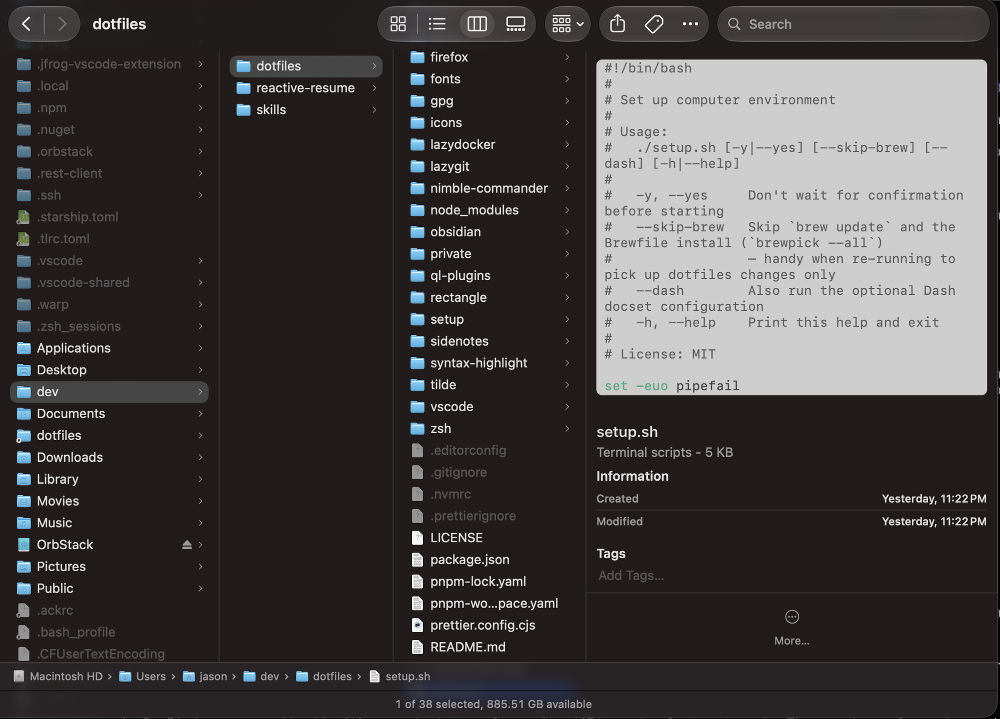
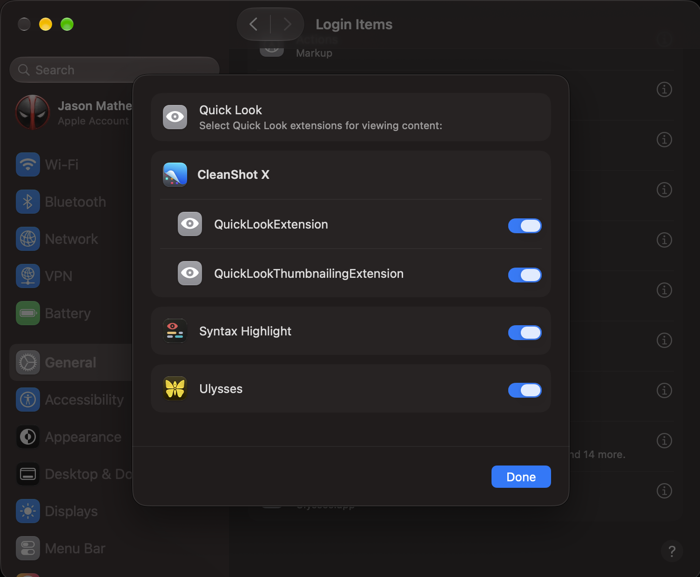

# Syntax Highlight

[Syntax Highlight](https://github.com/sbarex/SourceCodeSyntaxHighlight) adds syntax-highlighted source code to Finder's Quick Look previews. It's installed by the Brewfile (`cask "syntax-highlight"`).

This folder holds the Squirrelsong Light color scheme for the Syntax Highlight Quick Look extension: [themes/Squirrelsong Light.theme](themes/Squirrelsong%20Light.theme). The file is owned by this repo; import it in the app's color scheme settings, then choose it as the color scheme ([`install-color-themes`](../bin/install-color-themes) prints the path).

> [!IMPORTANT]  
> Launch the app once (`open -a "Syntax Highlight"`, or double-click it in `/Applications`) so macOS discovers its Quick Look extension — until then it doesn't appear in System Settings. Then turn it on in **System Settings** → **General** → **Login Items & Extensions** → **Extensions** → **Quick Look**.

